# Mind Matters
## Project Brief: Mental Health Awareness
### By Prajakta Sarnaik

[Link to Mind Matters website](https://prajaktasarnaik.github.io/mind-matters-project/)

- Description: 
Mind Matters is a thoughtfully designed platform aimed at promoting mental health awareness and providing essential resources, support, and connections for individuals seeking a path to well-being. With four dedicated sections—Awareness, Support, Resources, and Contact Us—the platform offers a comprehensive approach to mental health, ensuring users have access to valuable information and practical solutions in an interactive and engaging format.

The platform emphasizes accessibility, inclusivity and user engagement through responsive design, intuitive navigation, and visually appealing content.

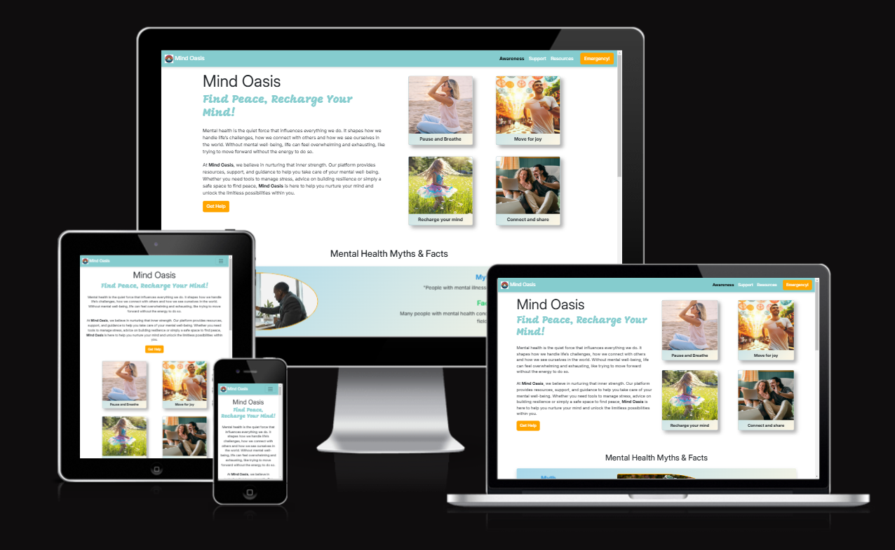

## **Table of Contents**

1. [Project Structure](#project-structure)
2. [UX](#ux)
3. [User Stories](#user-stories)
4. [Color Reference](#color-reference)
5. [Wireframes](#wireframes)
6. [Technologies](#technologies)
7. [Testing](#testing)
8. [Deployment](#deployment)
9. [Future Enhancements](#future-enhancements)
10. [Credits](#credits)

---

## Project Structure

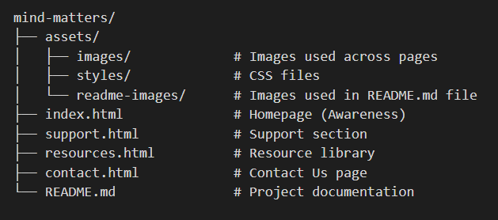

## Pages Overview and Features
- **Awareness (index.html):**
The homepage introduces users to the mission of "Mind Matters" and highlights the importance of mental health. An emergency helpline in the event of crisis helps people to seek immediate help.
Features problem-solution cards, testimonials , myths and facts and FAQs designed to enhance emotional well-being.
- **Support (support.html):**
A dedicated section offering avenues for seeking help, including links to one-on-one sessions, online consultation, support groups and activity groups provides actionable steps for coping with stress, anxiety, and depression.
- **Resources (resources.html):**
Includes videos to help users build a solid understanding of mental health, the problems and the solution.
- **Contact Us (contact.html):**
A form-based page allowing users to get in touch for queries, feedback or direct assistance.
Includes social media links, email and a physical address for further connection.

## UX

The Mind Matters platform is designed with a user-first approach, ensuring ease of navigation, accessibility, and engagement. Every element of the website has been carefully crafted to promote a seamless and enriching experience for users seeking mental health awareness and resources.

### Key UX Considerations
**1 . User-Centric Navigation**:

- A clean and intuitive navigation bar ensures users can easily switch between Awareness, Support, Resources and Contact pages.
- All content is categorized and presented in a structured manner for effortless exploration.

**2 . Responsive Design**:

- The website adapts flawlessly to all screen sizes, from mobile devices to large desktop displays.
- Responsive media elements like images, videos, and flip cards provide consistent interaction across devices.

**3 . Accessibility**:

- High-contrast text and well-defined font choices ensure readability for users with visual impairments.
- ARIA labels and semantic HTML enhance compatibility with screen readers.
- Touch-friendly elements make it easy for mobile users to interact with buttons, cards, and links.

**4 . Engaging Visuals**:

- Interactive flip cards and animations create a dynamic experience without overwhelming the user.
- The use of calming colors (like soft blues and greens) fosters a sense of trust and tranquility.

**5 . Content Clarity**:

- Short, impactful titles and descriptive paragraphs convey essential information effectively.
- Content is broken into digestible sections, avoiding overwhelming users with large text blocks.

**6 . Feedback Mechanism**:

- The Contact Us page provides a simple form for users to share feedback, ask questions or seek additional support.

**7 . Testimonials**:

- Testimonials create a sense of relatability and community.
- The design evokes a positive and encouraging vibe, reinforcing the message that users are not alone.

## User Stories

Implemented user stories for the creation of this website: 

**1. User Story 1:** (must-have)

As a website visitor, I want to understand the purpose of the site at a glance, so that I can decide if the website meets my needs for mental health resources and support.

**Acceptance Criteria**
 
- The homepage displays a clear and concise headline about mental health awareness.
- Features a welcoming design with calming visuals.
- A navigation menu is accessible at the top of the page.
- Includes an "Emergency" button showing helpline number for emergencies.
- Includes Myths and Facts about mental health.
- Includes mental health problems and their solutions.
- A dedicated section displays testimonials with user quotes, names (optional) and a profile picture/avatar (if provided).
- Includes a section for frequently asked questions (FAQs) about mental health.

**Tasks**

- Create a section with a headline and subheadline.
- Design a navigation menu with links to all key sections (Awareness, Support, Resources, Contact).
- Include images or video that evokes trust and calmness.
- Add a prominent "Emergency" button.
- Add carousel with image and Myths and Facts information.
- Add flip cards to tell about mental health problems and solutions.
- Design a testimonials section with user quotes, optional profile pictures, and attribution.
- Write and design an FAQ section addressing common concerns about Mental health.

**2. User Story 2:** (must-have) 

As a user in need of ongoing support, I want to find information about support groups, therapy options, and peer networks, so that I can connect with others and access personalized help.

**Acceptance Criteria**

- The support page lists various support options, including group sessions, one-on-one sessions and online communities.
- Each option provides a brief description and a link to join or learn more.
- Includes a section for frequently asked questions (FAQs) about mental health.

**Tasks**

- Make a provision to book for support groups, one-on-one sessions and online session.
- Ensure content accessibility for screen readers and mobile devices.

**3. User Story 3:** (must-have) 

As a user seeking mental health support, I want to find a list of reliable resources, so that I can access professional help or self-help guides.

**Acceptance Criteria**

- A list of resources (e.g., Helplines, Articles or Videos) is displayed.
- Each resource has a brief description and link to learn more.
- Resource content is easy to accessible on mobile devices.

**Tasks**

- Research and compile a list of trusted mental health videos.
- Test responsiveness for mobile and tablet devices.

**User Story 4:** (must-have) 

As a user in need of guidance, I want to contact the website team or access urgent helpline numbers, so that I can get help or share feedback about the site.

**Acceptance Criteria**

- The page includes a contact form with fields: Name, Email, Phone Number, Select from option and Message.
- Displays a emergency helpline with contact number.
- The form provides a success message after submission.

**Tasks**

- Design and implement the contact form.
- Add validation for required fields (e.g., email must be in proper format).
- Include an emergency helpline number.
- Disply a thank you pop up message after a form submission.

**User Story 5:** (must-have)

As a user, I want the website to adjust seamlessly to my device's screen size, so that I can have a smooth and user-friendly experience.

**Acceptance Criteria**

- The website adapts properly on mobile, tablet, and desktop devices.
- No horizontal scrolling or content overlap across any screen size.
- Media elements (images, videos) resize without distortion.
- Verify responsiveness on major browsers (eg. Chrome, Firefox, Safari).

**Tasks**

- Implement media queries for common breakpoints: mobile, tablet, desktop (if necessary).
- Use Bootstrap’s grid system and flex to structure responsive layouts.
- Test the layout on developer tools and physical devices.
- Optimize images and videos for scaling across devices. 
## Color Reference

Website used to generate color pallette :
[https://coolors.co/](https://coolors.co/)

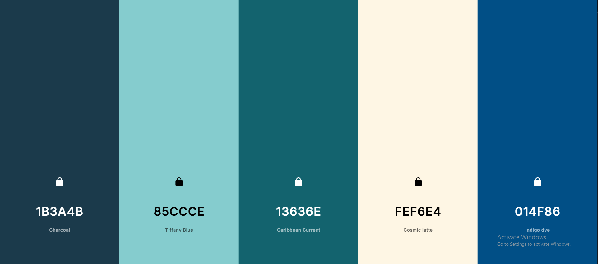

## Wireframes

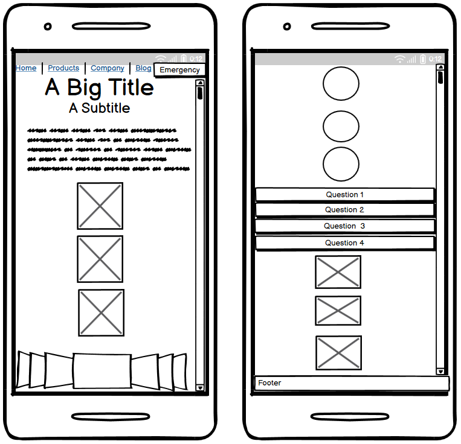
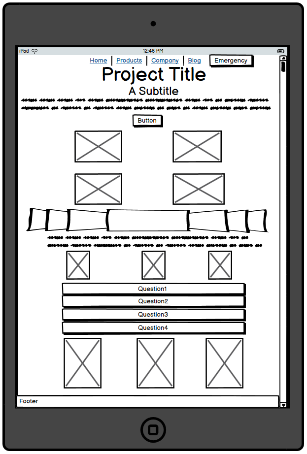
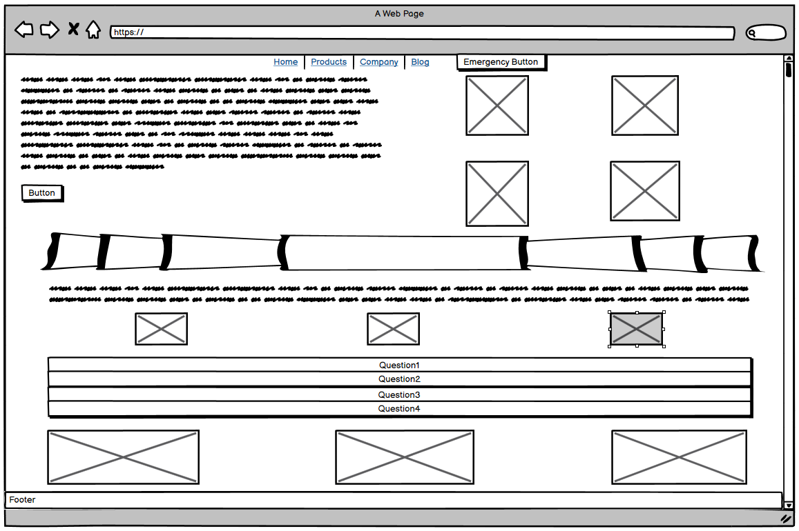
## Technologies

### Development Environment

This project was developed using the following tools and technologies:

- **IDE**: Visual Studio (Version X.X)
- **Languages**: HTML5, CSS3, Bootstrap 5
- **Version Control**: Git
- **Operating System**: Windows 10

## Testing

### Manual testing : 

- W3C validator screenshots for HTML pages:

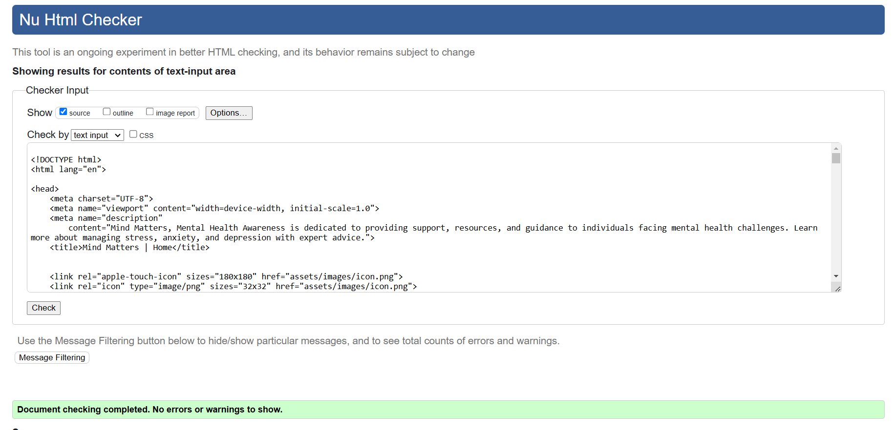
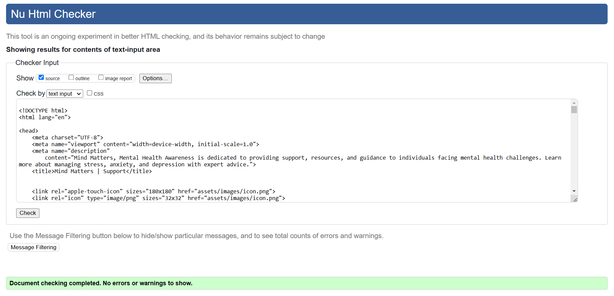
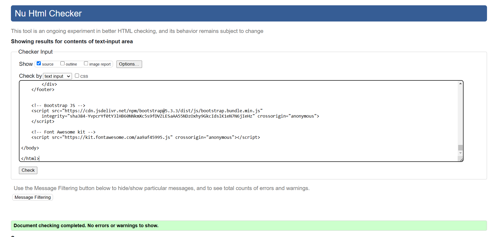
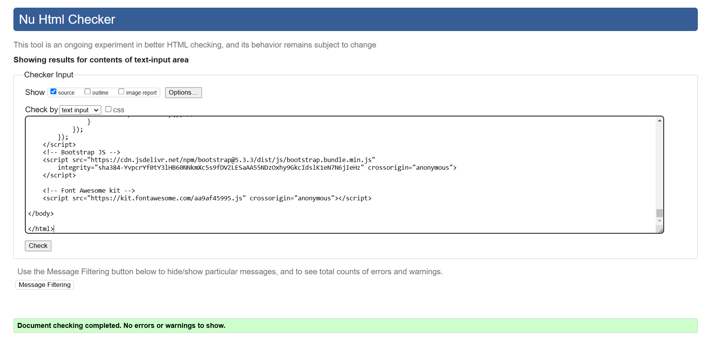

- W3C validator screenshots for CSS:

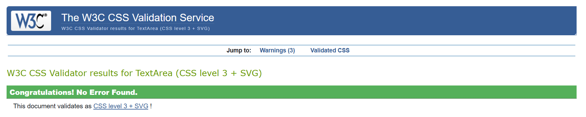

(I've added a small section of JavaScript for form validation based on Coding Coach- Spencer's recommendation.)
## Deployment

This section describes the process for deploymeny of the project from a hosting platform (e.g. GitHub)

This website was deployed through GitHub pages. The steps to deploy the project are as follows:

**1.** Navigate to the Settings tab in the GitHub repository.

**2.** From the source section drop-down menu, select the Main Branch. 

**3.** Once the Main branch has been selected, the page will be automatically refreshed with a detailed ribbon display to indicate the successful deployment.
## Future Enhancements

- Add a blog section for regular updates and user contributions.
- Include a chatbot for real-time support and queries.
- Enable user registration for personalized recommendations.
- Add multilingual support to reach a global audience.
## Credits

This project was made possible with the support of the following resources and tools:

- **[Coolors.co](https://coolors.co/)**: For creating and selecting the color palette used in the design.
- **[ChatGPT](https://openai.com/chatgpt)**: For providing guidance, suggestions, and assistance throughout the development process.
- **[GitHub Copilot](https://github.com/features/copilot)**: For helping to write efficient code and enhance productivity during development.
- **[YouTube](https://www.youtube.com/)**: For providing insightful tutorials and guidance on web development best practices.
- **[Bootstrap](https://getbootstrap.com/)**: For its powerful framework that enabled the creation of a responsive and visually appealing website.

A heartfelt thanks to my mentor **Emma** and coding coaches **Spencer** and **Roo** who guided me throughout this project. Their valuable feedback, support and encouragement were instrumental in shaping this website into its final form.

